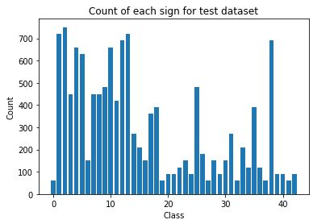

# **Traffic Sign Recognition** 

### The project analyzes the input image of german traffic sign and predicts the label for the image.

---

The goals / steps of this project are the following:
* Load the data set (click [here](https://d17h27t6h515a5.cloudfront.net/topher/2017/February/5898cd6f_traffic-signs-data/traffic-signs-data.zip) to download the project data set)
* Explore, summarize and visualize the data set
* Design, train and test a model architecture
* Use the model to make predictions on new images
* Analyze the softmax probabilities of the new images
* Summarize the results with a written report

[//]: # (Image References)

[image1]: ./examples/visualization.jpg "Visualization"
[image2]: ./examples/grayscale.jpg "Grayscaling"
[image3]: ./examples/random_noise.jpg "Random Noise"
[image4]: ./examples/placeholder.png "Traffic Sign 1"
[image5]: ./examples/placeholder.png "Traffic Sign 2"
[image6]: ./examples/placeholder.png "Traffic Sign 3"
[image7]: ./examples/placeholder.png "Traffic Sign 4"
[image8]: ./examples/placeholder.png "Traffic Sign 5"

## Rubric Points
### Here I will consider the [rubric points](https://review.udacity.com/#!/rubrics/481/view) individually and describe how I addressed each point in my implementation.  

---
### Writeup / README

#### 1. Provide a Writeup / README that includes all the rubric points and how you addressed each one. You can submit your writeup as markdown or pdf. You can use this template as a guide for writing the report. The submission includes the project code.

You're reading it! and here is a link to my [project code](https://github.com/udacity/CarND-Traffic-Sign-Classifier-Project/blob/master/Traffic_Sign_Classifier.ipynb)

### Data Set Summary & Exploration

#### 1. Provide a basic summary of the data set. In the code, the analysis should be done using python, numpy and/or pandas methods rather than hardcoding results manually.

I used the pandas library to calculate summary statistics of the traffic
signs data set:

* The size of training set is 34799
* The size of the validation set is 4410
* The size of test set is 12630
* The shape of a traffic sign image is 32x32x3
* The number of unique classes/labels in the data set is 43

#### 2. Include an exploratory visualization of the dataset.

Here is an exploratory visualization of the data set. It is a bar chart showing count of data for given classes.

### Design and Test a Model Architecture

#### 1. Preprocessing the image data.

Initially I trained my model on the given data set without any preprocessing and got around 87% accuracy. To increase the accuracy, I implemented preprocessing and got the accuracy up to 90%. This wasn't enough so to further increase it I went for data augmentation.
To augment the given training data I used rotation. Then I converted this augmented training dataset into grayscale followed by normalization.

Here is an example of a traffic sign image before and after grayscaling.

 

#### 2. Final model architecture.

My final model consisted of the following layers:

| Layer         		|     Description	        					| 
|:---------------------:|:---------------------------------------------:| 
| Input         		| 32x32x1 Grayscale image						| 
| Convolution 3x3     	| 1x1 stride, valid padding, outputs 28x28x6 	|
| RELU					|												|
| Max pooling	      	| 2x2 stride,  outputs 14x14x6	 				|
| Convolution 3x3	    | 1x1 stride, valid padding, outputs 10x10x16	|
| RELU					|												|
| Max pooling	      	| 2x2 stride,  outputs 5x5x16	 				|
| Flatten				| outputs 400  									|
| Fully connected		| outputs 120									|
| RELU					|												|
| Dropout				| 												|
| Fully connected		| outputs 84									|
| RELU					|												|
| Dropout				| 												|
| Fully connected		| outputs 43									|
| Softmax				| 												|
 
#### 3. Training the model.

To train the model, I used Adam Optimizer with learning rate = 0.001

I changed the batch size to 100 and the number of epochs to 42.

#### 4. Getting the desired validation accuracy (i.e. > 0.93). 

I used the LeNet architecture for my CNN. First I ran the model as is and got the validation accuracy of 0.87, without any preprocrssing of training data. Next I normalized the images which increased the validation accuracy
to around 0.90.
I further increased the accuracy by doing data augmentation also I used dropout layer in between the fully connected layers in the LeNet architecture.

The final values of the parameters I used -
* No. of epochs = 42
* Batch size = 100
* Learning rate = 0.001
* Keep prob for dropout = 0.7

My final model results were:
* training set accuracy of 1.00
* validation set accuracy of 0.973 
* test set accuracy of 0.943
 

### Testing the Model on New Images

Below are eight German traffic signs that I found on the web:

#### Model's predictions on these new traffic signs.

 Image			        				|     Prediction	        			| 
|:-------------------------------------:|:-------------------------------------:| 
| Stop sign      						| Stop sign   							| 
| Bumpy Road      						| Bumpy Road  							|
| 70 km/h     							| 70 km/h 								|
| Roundabout mandatory					| Roundabout mandatory					|
| No entry	      						| No Passing 						 		|
| Turn left ahead						| Turn left ahead      					|
| Wild animals crossing 				| Wild animals crossing					|
| Right-of-way at the next intersection	| Right-of-way at the next intersection	|

The model was able to correctly guess 7 of the 8 traffic signs, which gives an accuracy of 87.50%.

#### Softmax probabilities for each prediction.

The top 5 soft max probabilities were

For the first image ...

| Probability         		|     Prediction	        					| 
|:-------------------------:|:---------------------------------------------:| 
| 1.0         				| Stop sign   									| 
| 6.4124751032872975e-16		| Keep right							|
| 2.5295341950549196e-16	| No vehicles										|
| 3.11662753732984e-18	| Priority road						 				|
| 7.932785505240565e-20   	| No entry      							|

For the second image ...

| Probability         		|     Prediction	        					| 
|:-------------------------:|:---------------------------------------------:| 
| 0.5157997012138367						| Bumpy road   						| 
| 0.4635957181453705	| Bicycles crossing			|
| 0.020509354770183563		| Road work 								|
| 5.250752656138502e-05		| Wild animals crossing			 				|
| 2.0697008949355222e-05  	| Beware of ice/snow								| 
 
For the third image ...

| Probability         		|     Prediction	        					| 
|:-------------------------:|:---------------------------------------------:| 
| 0.9998396635055542		| Speed limit (70km/h) 				   						| 
| 0.00012139005411881953		| General caution								|
| 3.285313141532242e-05		| Speed limit (30km/h)											|
| 5.979827619739808e-06		| Stop					 				|
| 2.4457539993250066e-08   	| Priority road		 								|

For the fourth image ...

| Probability         		|     Prediction	        					| 
|:-------------------------:|:---------------------------------------------:| 
| 0.9818089604377747		| Roundabout mandatory 				   						| 
| 0.012037435546517372		| Speed limit (120km/h)								|
| 0.006035680416971445		| Speed limit (100km/h)											|
| 0.00010194475908065215		| Speed limit (20km/h)					 				|
|1.4727334928466007e-05   	| Speed limit (30km/h)		 								| 

For the fifth image ...

| Probability         		|     Prediction	        					| 
|:-------------------------:|:---------------------------------------------:| 
| 1.0						| No passing  		 						| 
| 6.099916765241005e-19		|No passing for vehicles over 3.5 metric tons									|
| 8.904519807246355e-20 	| Speed limit (30km/h)							|
| 1.8049882701022258e-21	| Roundabout mandatory			 				|
| 1.5343883303883637e-21   	| Ahead only		 							| 

For the sixth image ...

| Probability         		|     Prediction	        					| 
|:-------------------------:|:---------------------------------------------:| 
| 0.9719275832176208						| Turn left ahead   						| 
| 0.022670583799481392 	| Stop									|
| 0.002862347522750497 	| Keep right					|
| 0.0012113333214074373 	| Ahead only						 				|
| 0.0008556453394703567   	| No entry								| 

For the seventh image ...

| Probability         		|     Prediction	        					| 
|:-------------------------:|:---------------------------------------------:| 
| 1.0						| Wild animals crossing   		| 
| 1.430761620291321e-09	| Double curve							|
| 2.947466576364022e-11	| Dangerous curve to the left							|
| 2.4954813529929286e-16	| Bicycles crossing    					 			|
| 1.417311113883059e-17		| Road narrows on the right 	 							|

For the eight image ...

| Probability         		|     Prediction	        					| 
|:-------------------------:|:---------------------------------------------:| 
| 1.0						| Right-of-way at the next intersection   		| 
| 8.826455538679667e-11	| Beware of ice/snow							|
| 1.0646417422785145e-13	| Pedestrians							|
| 1.006456088751466e-15	| Roundabout mandatory    					 			|
| 11.2303850458534788e-18		| Road work 	 							|

